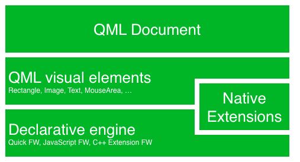

=================
Qt 5 kennenlernen
=================

.. sectionauthor:: `fer-rum <https://github.com/fer-rum>`_

.. issues:: ch01

.. note::

    Der Quellcode für diesen Abschnitt befindet sich im Ordner `assets <../../assets>`_.

.. note::
    
    Englische Fachbegriffe die keine übliche deutsche Entsprechung haben, wurden beibehalten. Sie werden nicht gesondert gekennzeichnet.

Das vorliegende Buch gibt eine schrittweise Einführung in die verschiedenen Aspekte der Anwendungsentwicklung mit *Qt* 5.x. Es konzentriert sich auf den Einsatz von *Qt Quick*, erläutert aber ebenfalls die Erstellung von C++ - Backends und Erweiterungen für *Qt Quick*. 

Dieses Kapitel gibt eine Übersicht über das *Qt* 5 - Framework. Dabei werden verschiedene Anwendungsmodelle vorgestellt, die dem Entwickler zur Verfügung stehen. Eine Beispielanwendung wird eine Vorschau auf die im Weiteren behandelten Themen geben.

Vorbemerkungen
==============

.. rubric:: Geschichtliches

Im Jahr 2005 begann die Entwicklung von *Qt* 4. Es bot seitdem eine solide Grundlage für tausende von Anwendungen, von Desktopumgebungen bis hin zu mobilen Systemen. Das Nutzungsverhalten hat sich in den vergangenen Jahren jedoch deutlich verändert. Mobile Geräte gewinnen zunehmend an Bedeutung, während klassische Desktop-PCs zunehmend verdrängt werden. Dadurch ändern sich auch die Erwartungen an das Interaktionsdesign. Während sich Fensterbasierte Ansätze auf Monitoren durchgesetzt haben, genügen sie nicht den Ansprüchen die von den Displays mobiler Geräte gestellt werden.

*Qt* 4 wurde optimiert um den Ansprüchen von Desktopsystemen zu genügen und eine kohärente Auswahl von UI-Elementen auf allen größeren Plattformen bereit zu stellen. Die gestellten Ansprüche haben sich im Laufe der Zeit hin zur touch-basierten Nutzerinteraktion verschoben. Mit *Qt* 4.7 wurde deshalb *Qt Quick* eingeführt, welches die Erstellung von UI-Komponenten auf der Basis einfacher Elemente erlaubt. Dadurch wird eine neue Art des UI-Designs möglich, welche sich stärker an die Anforderungen der Nutzer orientieren kann.

Der Fokus von *Qt* 5
--------------------

Seit dem Erscheinen von *Qt* 4.8 sind nahezu sieben Jahre vergangen. Daher wurde es Zeit für eine völlige Neuauflage dieses hervorragenden Frameworks in Form von *Qt* 5. Schwerpunkte waren dabei:

* **Hervorragende Grafik**: *Qt Quick* 2 is basiert auf OpenGL (ES) unter Nutzung von Szenengraphen. Der überarbeitete Grafikstack erlaubt ein neues Level von Grafikeffekten und ist dennoch vergleichbar einfach zu nutzen.

* **Produktivität der Entwickler**: *QML* und *JavaScript* sind die Hauptmittel für das Erstellen von UIs. Das Backend stützt sich auf *C++*. Die Trennung in *JavaScript* und *C++* erlaubt kurze Entwicklungszyklen für Frontend-Entwickler, die sich auf das Kreieren ansprechender Oberflächen konzentrieren, sowie für Backend-Entwickler, bei denen Stabilität, Performanz und das Erweitern der Laufzeitumgebung im Vordergrung steht.

* **Plattformübergreifende Kompatibilität**: Durch *Qt*s Abstraktion von Plattformen, ist es möglich, *Qt*-basierte Anwendungen einfacher und schneller auf andere Systeme zu portieren. Die Struktur von *Qt* stützt sich auf das Konzept von Kernmodulen und Erweiterungen. Dies erlaubt es den portierenden Entwicklern sich auf die Kernmodule zu konzentrieren und führt zu einer insgesamt kleineren Laufzeitumgebung.

* **Offene Entwicklung**: *Qt* ist ein öffentlich geführtes Projekt. Es wird auf `qt.io <http://qt.io>`_ gehostet. Die Entwicklung ist offen und Community-basiert.

Einführung in *Qt* 5
====================

*Qt Quick*
----------

*Qt Quick* ist der Sammelbegriff für die UI-Technologien, die in *Qt* 5 genutzt werden. Dies beinhaltet:

* Die Markup-Sprache *QML* zur Beschreibung der Nutzeroberfläche
* *JavaScript* für das Scripten dynamischer Inhalte
* Portierbare *Qt C++* Bibliotheken

*QML* ist, ähnlich wie z.B. *HTML*, eine Markup-Sprache. Sie besteht aus Elementen, die *tags* genannt werden. Deren Inhalt wird in geschweiften Klammern eingeschlossen: ``Item{}``. Die Sprache wurde von Anfang an entworfen, um das Erstellen von Nutzerschnittstellen zu vereinfachen und dennoch für Entwickler einfach lesbar zu sein. Es ist weiterhin möglich, *JavaScript*-Code zu integrieren.
*Qt Quick* kann sehr einfach mit eigener Funktionalität auf Grundlage von *Qt C++* ergänzt werden.
Die Deklarationen der (grafischen) Nutzerschnittstelle werden im Folgenden als *Front-End* bezeichnet, während der native Codeteil das *Back-End* bildet. Diese Trennung erlaubt es, berechnungsintensive Teile der Anwendung von der Nutzerschnittstelle zu trennen. Meist geht damit auch eine Trennung der Verantwortungsbereiche der Entwickler einher. Üblicherweise ist das Front-End in *QML*/*JavaScript* geschrieben und bietet eine Schnittstelle für das System. Währenddessen wird im Back-End die eigentliche Arbeit geleistet. Letzteres sollte mit *Qt's* eigenem Unit-testing Framework auf seine korrekte Funktionalität geprüft werden und wird dann in Form einer Programmierschnittstelle für die Front-End Entwickler exportiert.

Digesting an User Interface
---------------------------

Let's create a simple user interface using Qt Quick, which showcases some aspects of the QML language. At the end we will have a paper windmill with rotating blades.

.. image:: assets/scene.png
    :scale: 50%

We start with an empty document called ``main.qml``. All QML files will have the ending ``.qml``. As a markup language (like HTML) a QML document needs to have one and only one root element, which in our case is the ``Image`` element with a width and height based on the background image geometry:

.. code-block:: qml

    import QtQuick 2.3

    Image {
        id: root
        source: "images/background.png"
    }

As QML does not make any restriction which element type is the root element we use an ``Image`` element with the source property set to our background image as the root element.

.. image:: src/showcase/images/background.png

.. note::

    Each element has properties, e.g. a image has a ``width``, ``height`` but also other properties like a ``source`` property.  The size of the image element is automatically deducted from the image size. Otherwise we would need to set the ``width`` and ``height`` property to some useful pixel values.

    The most standard elements are located in the ``QtQuick`` module which we include in the first line with the import statement.

    The ``id`` special property is optional and contains an identifier to reference this element later in other places in the document. Important: An ``id`` property cannot be changed after it has been set and it cannot be set during runtime. Using ``root`` as the id for the root-element is just a habit by the author and makes referencing the top-most element predictable in larger QML documents.

The foreground elements pole and pin wheel of our user interface are placed as separate images.

.. image:: src/showcase/images/pinwheel.png

The pole needs to be placed in the horizontal center of the background towards the bottom. And the pinwheel can be placed in the center of the background.

Normally your user interface will be composed of many different element types and not only image elements like in this example.

.. code-block:: qml

  Image {
      id: root
      ...
      Image {
          id: pole
          anchors.horizontalCenter: parent.horizontalCenter
          anchors.bottom: parent.bottom
          source: "images/pole.png"
      }

      Image {
          id: wheel
          anchors.centerIn: parent
          source: "images/pinwheel.png"
      }
      ...
  }

To place the pin wheel at the central location we use a complex property called ``anchor``. Anchoring allows you to specify geometric relations between parent and sibling objects. E.g. Place me in the center of another element ( ``anchors.centerIn: parent`` ). There are left, right, top, bottom, centerIn, fill, verticalCenter and horizontalCenter relations on both ends. Sure they need to match, it does not make sense to anchor my left side to the top side of an element.

So we set the pinwheel to be centered in the parent our background.

.. note::

    Sometime you will need to make small adjustments on the exact centering. This would be possible with ``anchors.horizontalCenterOffset`` or with ``anchors.verticalCenterOffset``. Similar adjustments properties are also available to all the other anchors. Please consult the documentation for a full list of anchors properties.

.. note::

    Placing an image as a child element of our root element (the ``Image`` element) shows an important concept of a declarative language. You describe the user interface in the order of layers and grouping, where the topmost layer (our rectangle) is drawn first and the child layers are drawn on top of it in the local coordinate system of the containing element.

To make the showcase a little bit more interesting, we would like to make the scene interactive. The idea is to rotate the wheel when the user pressed the mouse somewhere in the scene.

We use the ``MouseArea`` element and make it as big as our root element.

.. code-block:: qml

    Image {
        id: root
        ...
        MouseArea {
            anchors.fill: parent
            onClicked: wheel.rotation += 90
        }
        ...
    }

The mouse area emit signals when a user clicks inside it covered area. You can hook onto this signal overriding the ``onClicked`` function. In this case the reference the wheel image and change its rotation by +90 degree.

.. note::

    This works for every signal, the naming is ``on`` + ``SignalName`` in title cases. Also all properties emit a signal when their value changed. The naming is:

        ``on`` + ``PropertyName`` + ``Changed``

    If a ``width`` property is changing you can observe it with ``onWidthChanged: print(width)`` for example.

Now the wheel will rotate, but it is still not fluid yet. The rotation property changes immediately. What we would like that the property changes by 90 degree over time. Now animations come into play. An animation defines how a property change is distributed over a duration. To enable this we use an animation type called property behavior. The ``Behaviour`` does specify an animation for a defined property for every change applied to that property. In short every time the property changes, the animation is run. This is only one of several ways of declaring an animation in QML.

.. code-block:: qml

    Image {
        id: root
        Image {
            id: wheel
            Behavior on rotation {
                NumberAnimation {
                    duration: 250
                }
            }
        }
    }

Now whenever the property rotation of the wheel changes it will be animated using a ``NumberAnimation`` with a duration of 250 ms. So each 90 degree turn will take 250 ms.

.. image:: assets/scene2.png
    :scale: 50%

.. note:: You will not actually see the wheel blurred. This is just to indicate the rotation. But a blurred wheel is in the assets folder. Maybe you want to try to use that.

Now the wheel looks already much better. I hope this has given you a short idea of how Qt Quick programming works.

Qt Building Blocks
==================

Qt 5 consists of a large amount of modules. A module in general is a library for the developer to use. Some modules are mandatory for a Qt enabled platform. They form a set called *Qt Essentials Modules*. Many modules are optional and form the *Qt Add-On Modules*. It's expected that the majority of developers will not have the need to use them, but it's good to know them as they provide invaluable solutions to common challenges.

Qt Modules
---------------------

The Qt Essentials modules are mandatory for a Qt enabled platform. They offer the foundation to develop a modern Qt 5 Application using Qt Quick 2.

.. rubric:: Core-Essential Modules

The minimal set of Qt 5 modules to start QML programming.

.. list-table::
    :widths: 20 80
    :header-rows: 1

    *   - Module
        - Description
    *   - Qt Core
        - Core non-graphical classes used by other modules
    *   - Qt GUI
        - Base classes for graphical user interface (GUI) components. Includes OpenGL.
    *   - Qt Multimedia
        - Classes for audio, video, radio and camera functionality.
    *   - Qt Network
        - Classes to make network programming easier and more portable.
    *   - Qt QML
        - Classes for QML and JavaScript languages.
    *   - Qt Quick
        -  declarative framework for building highly dynamic applications with custom user interfaces.
    *   - Qt SQL
        - Classes for database integration using SQL.
    *   - Qt Test
        - Classes for unit testing Qt applications and libraries.
    *   - Qt WebKit
        - Classes for a WebKit2 based implementation and a new QML API. See also Qt WebKit Widgets in the add-on modules.
    *   - Qt WebKit Widgets
        - WebKit1 and QWidget-based classes from Qt 4.
    *   - Qt Widgets
        - Classes to extend Qt GUI with C++ widgets.

.. digraph:: essentials

    QtGui -> QtCore
    QtNetwork ->QtCore
    QtMultimedia ->QtGui
    QtQml -> QtCore
    QtQuick -> QtQml
    QtSql -> QtCore

.. rubric:: Qt Addon Modules

Besides the essential modules, Qt offers additional modules for software developers, which are not part of the release. Here is a short list of add-on modules available.

* Qt 3D - A set of APIs to make 3D graphics programming easy and declarative.
* Qt Bluetooth - C++ and QML APIs for platforms using Bluetooth wireless technology.
* Qt Contacts - C++ and QML APIs for accessing addressbooks / contact databases
* Qt Location - Provides location positioning, mapping, navigation and place search via QML and C++ interfaces. NMEA backend for positioning
* Qt Organizer - C++ and QML APIs for accessing organizer events (todos, events, etc.)
* Qt Publish and Subscribe
* Qt Sensors - Access to sensors via QML and C++ interfaces.
* Qt Service Framework -  Enables applications to read, navigate and subscribe to change notifications.
* Qt System Info - Discover system related information and capabilities.
* Qt Versit - Support for vCard and iCalendar formats
* Qt Wayland - Linux only. Includes Qt Compositor API (server), and Wayland platform plugin (clients)
* Qt Feedback - Tactile and audio feedback to user actions.
* Qt JSON DB - A no-SQL object store for Qt.

.. note::

    As these modules are not part of the release the state differ between modules, depending how many contributors are active and how well it's get tested.

Supported Platforms
-------------------

Qt supports a variety of platforms. All major desktop and embedded platforms are supported. Through the Qt Application Abstraction, nowadays it's easier to port Qt over to your own platform if required.

Testing Qt 5 on a platform is time consuming. A sub-set of platforms was selected by the Qt Project to build the reference platforms set. These platforms are thoroughly tested through the system testing to ensure the best quality. Mind you though: no code is error free.

Qt Project
==========

From the `Qt Project wiki <http://wiki.qt.io/>`_:

"The Qt Project is a meritocratic consensus-based community interested in Qt. Anyone who shares that interest can join the community, participate in its decision making processes, and contribute to Qt’s development."

The Qt Project is an organisation which developes the open-source part of the Qt further. It forms the base for other users to contribute. The biggest contributor is DIGIA, which holds also the comercial rights to Qt.

Qt has an open-source aspect and a comercial aspect for companies. The comercial aspect is for companies which can not or will not comply with the open-source licenses. Without the comercial aspect these companies would not be able to use Qt and it would not allow DIGIA to contribute so much code to the Qt Project.

There are many companies world-wide, which make their living out of consultancy and product development using Qt on the various platforms. There are many open-source projects and open-source developers, which rely on Qt as their major development library. It feels good to be part of this vibrant community and to work with this awesome tools and libraries. Does it make you a better person? Maybe:-)

**Contribute here: http://wiki.qt.io/**
